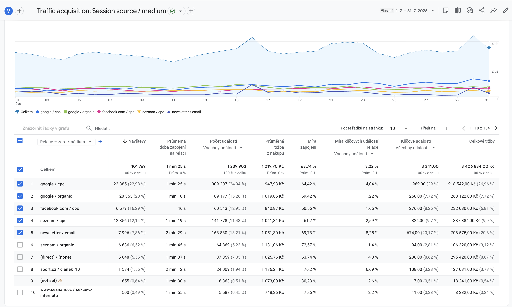
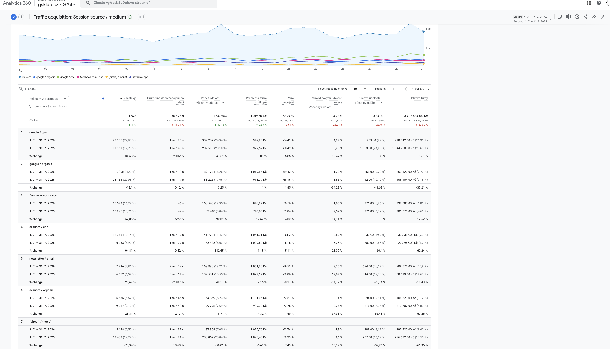

# GS M2M report: doplneni cervence 2026 do dashboardu a GA4

Datum zadani: 2026-08-10

## Kontext

Toto zadani patri do projektu **GS M2M reports**:

`/Users/giorgiotrantina/Documents/GS M2M reports`

Cilem je navazat na predchozi report tak, aby z nej vznikal sousledny datovy pohled mesic po mesici, vzdy ve stejnem formatu. Tam, kde uz report obsahuje predchozi mesice, nema vznikat nova izolovana sekce nebo nova logika. Prosim pouze doplnit dalsi mesic **Cervenec 2026** do existujici struktury.

## Zdrojova tabulka

Data pro dashboardovou cast vychazeji z Google Sheetu:

https://docs.google.com/spreadsheets/d/1_i_65sFTSmBv_HUupfr6eF2bMF9hjhIiV0r7qqVIVXU/edit?gid=1566186728#gid=1566186728

Screenshot dashboardove tabulky byl drive predan jako vizualni reference. Primarni zdroj pro hodnoty ma byt Google Sheet, screenshot pouze pomaha s pochopenim struktury, popisku a formatu.

## Referencni screenshoty GA4

Screenshoty byly omylem ulozeny do puvodniho projektu, nasledne zachraneny a maji byt preneseny do GS projektu.

Doporucene umisteni v GS projektu:

- `public/assets/references/ga4-traffic-acquisition-july-2026-top10.png`
- `public/assets/references/ga4-traffic-acquisition-july-2026-yoy.png`

Nahledy:

## Obecne zadani pro Codera

Prosim doplnit cervencova data do projektu GS M2M reportu.

Hlavni princip:

- Navazat na predchozi mesice ve stejnem formatu.
- Tam, kde uz jsou predchozi mesice, pouze doplnit **Cervenec 2026**.
- Nerozbijet stavajici strukturu reportu, layout, animace, efekty, ikony, vlajecky ani interpunkci.
- Dashboard nema byt jednorazovy blok pro cervenec, ale prubezny MoM pohled.
- Starší mesice maji zustat dostupne ve stejne collapse/expand logice jako dosud.
- Pokud uz existuje globalni collapse/expand pro TOP10, mesicni prehledy nebo mesicni sekce, napojit na nej i nove doplneny cervenec.

## Dashboardova cast

Navazat na jiz pripraveny dashboardovy zacatek reportu a doplnit cervencova cisla.

Dashboard ma slouzit jako jedno misto pro rychly pohled na dulezite metriky:

- celkovy spend,
- celkovy reach / navstevnost podle dostupnych dat,
- celkove trzby,
- PNO,
- porovnani plan vs. realita,
- rozpad podle kanalu / zemi, pokud je ve stavajicim reportu k dispozici.

Pokud uz jsou v reportu data za predchozi mesice, prosim doplnit cervenec jako dalsi sloupec nebo dalsi polozku ve stejne datove strukture.

## Cervenec 2026: hodnoty z dashboardove tabulky

### Plan trzby 2026

- Plan 2025: 3 655 063,97 Kc
- Realita 2025: 4 628 979,98 Kc
- Realita Korekce 2025: 4 628 979,98 Kc
- Plan 2026: 4 738 841,81 Kc
- Realita 2026: 3 600 000 Kc
- Rozdil plan vs. realita: -1 138 842 Kc
- Revenue GA4: 3 406 834 Kc
- PNO realita: 18,77 %

### Budget GS KLUB 2026

- Monthly budget: 375 000 Kc
- Celkem cerpano: 675 594 Kc
- Realita Google: 384 966 Kc
- Realita Seznam: 180 497 Kc
- Realita META: 101 005 Kc
- Realita Heureka: 3 356 Kc
- Realita Zbozi: 5 770 Kc
- Brand SoMe: 11 191 Kc

Poznamka: `Celkem cerpano` odpovida souctu viditelnych vykonnostnich kanalu Google + Seznam + META + Heureka + Zbozi. Brand SoMe drzet oddelene, pokud ve stavajici logice neni zahrnuty do celkoveho cerpani.

## Google Analytics cast

Prosim doplnit Cervenec 2026 do existujici casti Google Analytics. Pokud uz tam jsou predchozi mesice, nerozsirovat report novym formatem, ale pridat cervencova cisla jako dalsi mesic ve stejnem stylu.

Obdobi: **1. 7. - 31. 7. 2026**

### Celkova data GA4

- Celkove navstevy: 101 769
- Celkove trzby: 3 406 834 Kc
- Klicove udalosti: 3 341
- Prumerna doba zapojeni: 1 min 25 s
- Mira zapojeni: 63,74 %

### TOP zdroje podle source / medium

- google / cpc: 23 385 navstev, 969 klicovych udalosti, 918 542 Kc trzby
- google / organic: 20 353 navstev, 258 klicovych udalosti, 263 122 Kc trzby
- facebook.com / cpc: 16 579 navstev, 276 klicovych udalosti, 232 080 Kc trzby
- seznam / cpc: 12 356 navstev, 324 klicovych udalosti, 337 384 Kc trzby
- newsletter / email: 7 996 navstev, 674 klicovych udalosti, 708 575 Kc trzby

## Insight k vypichnuti v textu

V textove casti Google Analytics prosim vypichnout zajimavost, ze zdroj **sport.cz / clanek_10** prinesl v cervenci relevantni navstevnost a zaroven i konverze.

Data pro `sport.cz / clanek_10`:

- Navstevy: 1 584
- Mira zapojeni: 76,2 %
- Klicove udalosti: 108
- Trzby: 127 031 Kc

Navrzena formulace:

> Zajimavym momentem cervence byl vykon zdroje sport.cz / clanek_10. Clanek privedl 1 584 navstev, udrzel velmi dobrou miru zapojeni 76,2 % a zaroven vygeneroval 108 klicovych udalosti s trzbami 127 031 Kc. Neslo tedy pouze o navstevnostni zasah, ale o traffic, ktery dokazal prispet i ke konverzim.

## Pozadavky na layout a chovani

- Zachovat vizualni styl GS reportu.
- Zachovat stejne efekty a animace jako ve stavajicich sekcich.
- Zachovat vlajecky, ikonky a interpunkci.
- Novy cervencovy obsah nesmi pusobit jako vlozeny externi blok, ale jako prirozene pokracovani MoM reportu.
- Collapse/expand musi fungovat globalne pro:
  - TOP10 prehledy,
  - mesicni prehledy,
  - starsi mesicni sekce.
- Pokud jsou starsi mesice schovane pod tlacitkem s nazvem mesice v hlavicce, Cervenec 2026 ma byt pridan do stejneho systemu.

